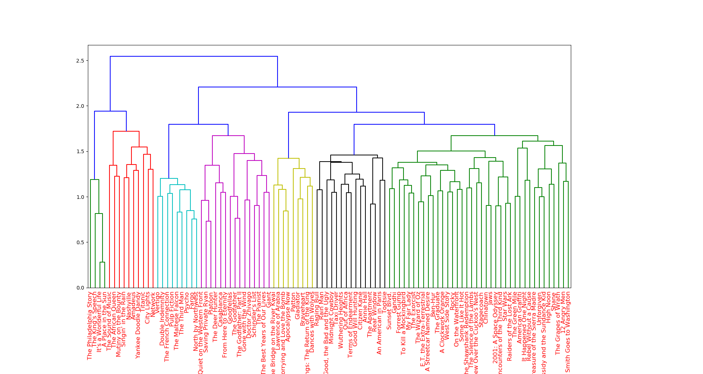

# Movies-Similarity---NLP


This is a text similarity Natural Language Processing project in which different movies are compared on the basis of their plots. 

This is Achieved via TF-IDF.


This will be the output 


Output is in the form of the Tree in which Leaf nodes indicate the movie title and similar movies are grouped together.

## Usage

First install the required libraries from the **requirements.txt** file.
type this command in the bash

```bash
pip install -r requirements.txt
```

after that run 
```bash
python main.py
```


## Requirements

- Python 3
- Natural Language Tool Kit (NLTK)
- Sklearn
- Scipy 
- rest in **requirements.txt** file
